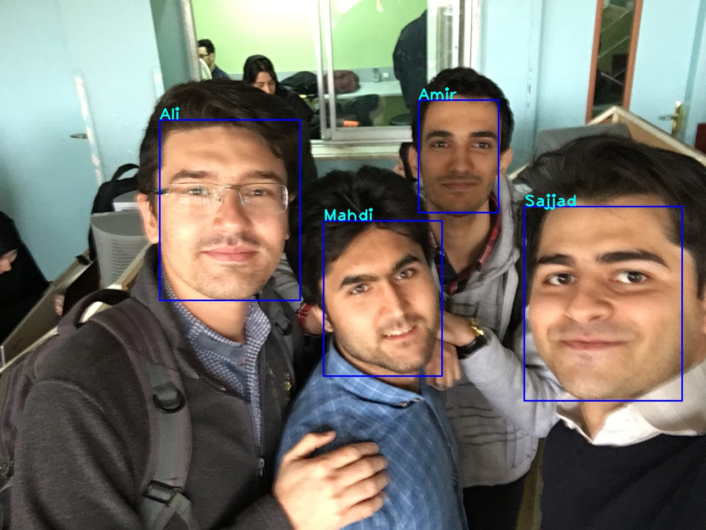

# Face Recognition
Real-time face recognition in unconstrained environments

This module can get a number of names as input for tracking the specific face.



## Installation
1- clone the repository

2- install requirements
```
pip install -r requirements.txt
```
3- download required model files: 
```
python download_weights.py
```

## Test and run
Put your input images or videos in ./input directory. The output will be saved in ./output. 
In root directory of project, run the following command: 
```
python main.py -i "./input/sample.mp4" -u --type name -names ['Amir', 'Sajjad', 'Mahdi', 'Ali']
```
Use -sh for representation of results during code running or not

Note that you can pass some other arguments. Take a look at *main.py*, *parse_args* fanction.