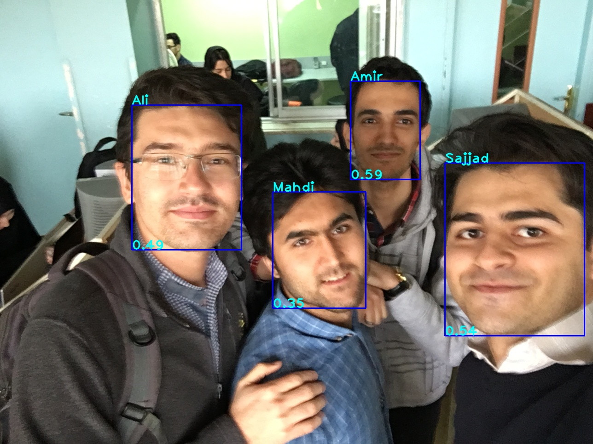

# Face Recognition with Arcface

Arcface is a efficient and effective face recognition algorithm, which can train on tens of millions identity on a single server.
Real-time face recognition in unconstrained environments. Using [Shuffle Attention MobileNetV3](https://github.com/SajjadAemmi/SA-MobileNetV3) Architecture as Backbone, and modified ArcFace as loss function.

This module can get a number of names as input for tracking the specific face.



## Experiments

#### on LFW

Attempt | Parameters | Madds | Top1-acc
--- | --- | --- | --- |
Mobile Face Net |  |  |  |
SA-MobileNetV3-Large with modified ArcFace loss |  |  |  |


## Installation

1- Install [pytorch](http://pytorch.org) (torch>=1.6.0).

2- install requirements
```
pip install -r requirements.txt
```
3- MobileNet weights exist in `./weights` directory. if you want ResNet weights, download with this command: 
```
python download_weights.py
```
4- Downlaod SCRFD pretrained-models from [here](https://github.com/deepinsight/insightface/tree/master/detection/scrfd#pretrained-models)

## Docker

1- Build docker image
```
docker build -t face_recognition .
```
2- Run docker container
```
docker run --gpus all -it --rm -v $(pwd):/workspace/face-recognition -it face_recognition bash
```

## Dataset

Download the dataset from [here](https://github.com/deepinsight/insightface/tree/master/recognition/_datasets_).


## Train

To train a model, run `train.py` with the path to the configs. for example if you want train SA-MobileNetV3, run this command:

```
python train.py configs/webface_samnv3
```

Train on multi GPUs:
```
python -m torch.distributed.launch --nproc_per_node=4 --nnodes=1 --node_rank=0 train.py configs/webface_samnv3
```
other configs are available in `./configs`


## Test

Run the following command for evaluation trained model on test dataset:
```
python ...
```


## Predict

Run the following command for classification images:
```
python predict.py --input input/sajjad_0.jpg
```


## Inference

For feature extraction, run this command:
```
python inference_compare.py --input1 input/sajjad_0.jpg --input2 input/sajjad_1.jpg
```

Put your input images or videos in ./input directory. The output will be saved in ./output. 
In root directory of project, run the following command: 
```
python inference_video.py --input "./IO/input/sample.mp4" --update
```
or
```
python inference_image.py --input "./IO/input/sajjad.jpg" --update
```

Use -sh for representation of results during code running or not

Note that you can pass some other arguments. Take a look at `--help` argument for each command.


## Citation

```
@inproceedings{deng2019arcface,
  title={Arcface: Additive angular margin loss for deep face recognition},
  author={Deng, Jiankang and Guo, Jia and Xue, Niannan and Zafeiriou, Stefanos},
  booktitle={Proceedings of the IEEE Conference on Computer Vision and Pattern Recognition},
  pages={4690--4699},
  year={2019}
}
```