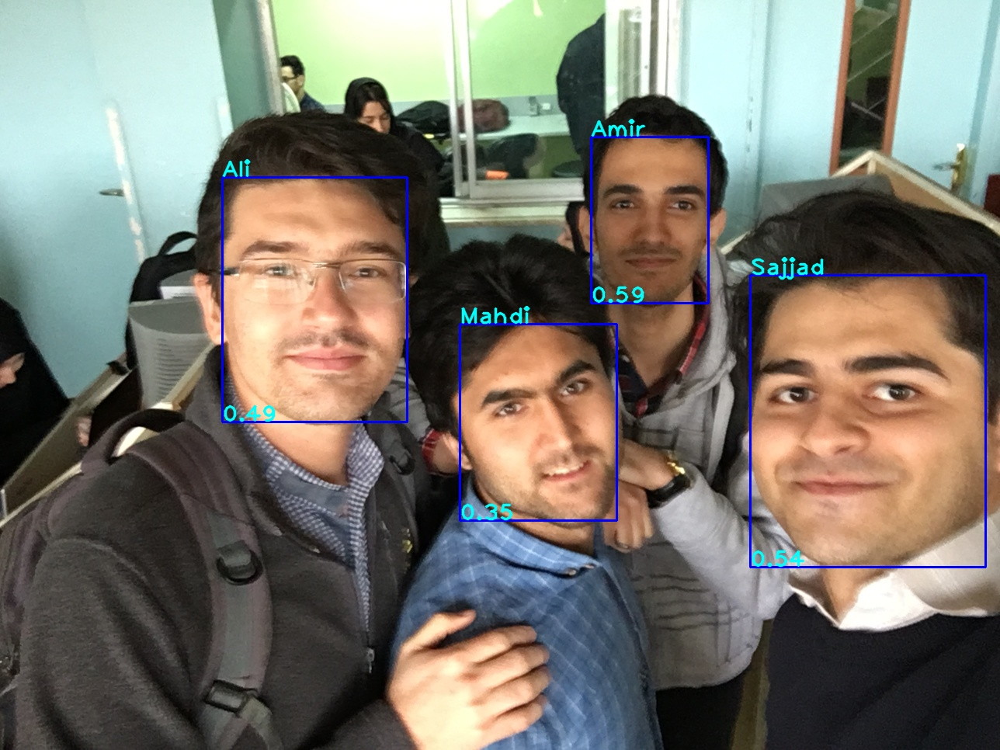

# Face Recognition
Real-time face recognition in unconstrained environments

This module can get a number of names as input for tracking the specific face.

Using [Shuffle Attention MobileNetV3](https://github.com/SajjadAemmi/SA-MobileNetV3) Architecture as Backbone



## Installation
1- clone the repository

2- install requirements
```
pip install -r requirements.txt
```
3- download required model files: 
```
python download_weights.py
```


## Train

Run the following command for train model on your own dataset:
```
python train.py --dataset mnist 
```

## Test

Run the following command for evaluation trained model on test dataset:
```
python test.py --dataset mnist
```

## Predict

Run the following command for classification images:
```
python predict.py --input /path/to/image.jpg 
```


## Inference
Put your input images or videos in ./input directory. The output will be saved in ./output. 
In root directory of project, run the following command: 
```
python main.py -i "./input/sample.mp4" -u
```
Use -sh for representation of results during code running or not

Note that you can pass some other arguments. Take a look at *main.py* file.