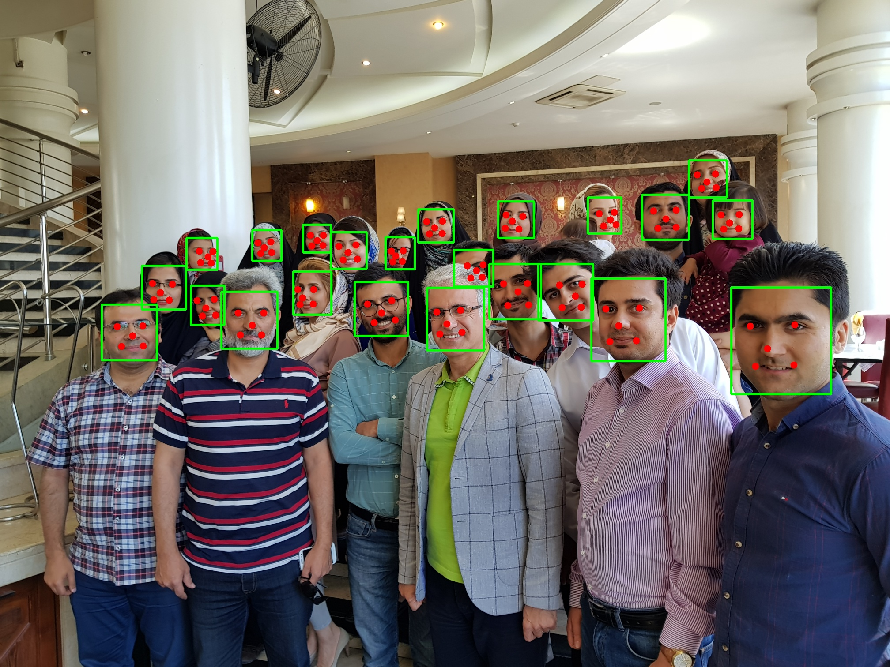

# Retina Face Detector

RetinaFace is a deep learning based cutting-edge real-time facial detector for Python coming with facial landmarks in unconstrained environments.

RetinaFace is the face detection module of [insightface](https://github.com/deepinsight/insightface) project. The original implementation is mainly based on mxnet. Then, its pytorch based re-implementation and its source code is simplified, but the main structure of the reference model and its pre-trained weights are same.




## Installation
1- clone the repository

2- install requirements
```
pip install -r requirements.txt
```
3- download required model files: 
```
python download_weights.py
```


## Inference
Put your input images or videos in `./input` directory. The output will be saved in `./output` directory. 
In root directory of project, run the following command for image: 

```
python inference_image.py --input "./input/test.jpg"
```
and for video:
```
python inference_video.py --input "./input/obama.mp4"
```
Use -sh for show results during code running or not

Note that you can pass some other arguments. Take a look at `inference_video.py` file.
